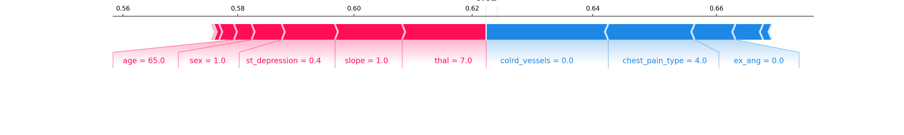

# Heart Failure Analysis
Using ML techniques to predict heart disease from patient data. Combination of cross validation, grid search and Random Forest for training and SHAP analysis for evaluation of features.

## Goal
Using the [UCI dataset](https://archive.ics.uci.edu/ml/datasets/Heart+Disease) containing 303 records of patient data entailing 13 parameters with potential predictive power to predict  heart failure I chose to apply predictive modelling techniques to build a classifier for heart failure and identify predictive parameters.

## Approach
To build and improve model and analysis were iteratively carried out:
 1. Load and explore the data
 2. Process and clean the model for training
 3. Model training and hyperparameter tuning
 4. Evaluation of model performance
 5. Analysis of feature importance & visualisation

## Preprocessing & cleaning
The “processed.cleveland.data”-file does contain records of 303 records of individuals who went through a series of tests and got diagnosed with no heart disease (0) or their heart disease category (1-4) . This yielded 13 independent variables and the dependent variable which was transformed into a two class variable to model the prevalence of heart disease using the 13 independent variables.
The few ‘?’ values were replaced with -9  as negative values aren’t prevalent in the dataset at all and the absence of data in this case might be valuable as well as it allows to avoid loss off a few data points.
Transforming the heart_disease target variable into a 2 class variable conveniently lead to two almost even classes (139 samples with heart disease, 164 without). Hence no measures (over/undersampling) to balance the classes were taken at this point.
Because of my choice of algorithm random forest to try first feature scaling wasn’t necessary at this point. 
15% of the dataset were set aside in a testing set. This was kept a bit low as cross validation would  run with a 20% validation set (of the remaining 85%) for each cross validation split.
At a later stage a standard scaler was used to scale data for a Support Vector Machine classifier.
Further data engineering could be done by looking at the other datasets including more parameters as well as doing feature engineering such as quantizing features or combining existing ones.

## Model training, hyperparameter tuning & feature importance analysis
Random forest was chosen as my first algorithm for several reasons. Tree based methods are fairly simple yet perform well in many situations (e.g. Kaggle competitions), are easy to train, don’t require much preprocessing (scaling is not necessary), tend to not overfit easily, generalise well in their ensemble variants and I have good experience with them. To find good hyperparameters for it I launched a [grid search](https://scikit-learn.org/stable/modules/generated/sklearn.model_selection.GridSearchCV.html?highlight=grid%20search#sklearn.model_selection.GridSearchCV) over a range of parameters with 5 fold cross validation. Cross validation allowed me to not “lose” training data for validation of hyperparameters due to the 5 fold training/validation split without leakage of validation data into training to validate (hyper)parameters while still validating on all of it.
The first random forest  model I trained achieved a very acceptable accuracy of 85.2% with and F1 score of 83.0% on the test set. The grid search found parameters generating 85.1% accuracy and 83.4% F1 score on the validation sets and 86.9% accuracy and 85.2% F1 score on the test set.
To avoid overfitting I took care to monitor validation and training accuracy are close and that the number of estimators isn’t unnecessarily large. The minimum allowed samples in a leafe is low (3) but the accuracy score suggest that this is acceptable.
As an alternative a support vector machine classifier has been trained has well using cross validation, grid search and a standard scaler. And a good F1 score of 81.9% on the validation sets was reached. This is promising and could be used in conjunction with the random forest classifier and maybe a logistic regression model in a voting classifier. In such an ensemble the very different models may be able to make up for individual weaknesses and jointly improve model performance further.

## Feature evaluation & Visualisation
Another advantage of the random forest algorithm is that the model importances are already provided. Here it was chosen to in addtition use the shap library ([background](https://christophm.github.io/interpretable-ml-book/shap.html#shap), [library and examples](https://github.com/slundberg/shap)) as it allows intuitive visualisations and the tree based method is fast to compute.

 | 
------------ | -------------
_**Figure 1**_: Feature importance ranking based on SHAP | _**Figure 2**_: SHAP summary plot for class 1 (having heart disease). Chest pain type, thal, and number of coloured major bloodvessel are features with very high predictive power.

As can be seen in Figure 1 and 2 the features chest pain type, “thal” and the number of coloured bloodvessels have been major contributors to the predictive power of the model and higher values for those features are used by the model to predict prevalence of heart disease.

The shap library provides as well functionality to visualise for an individual data point how each feature contributed to the prediction outcome.

-------- |
_**Figure 3**_: SHAP force graph for an individual with heart disease prediction. Red feature contribute to a heart disease prediction while blue ones push towards a no heart disease diagnosis. In this case the balance is explaining the hear disease diagnosis

A next step visualisation could be a confusion matrix and analysis of misclassified datapoints.
